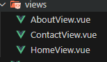
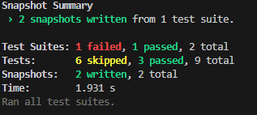

- [Desafío Prueba Unitaria en Entorno Vue](#desafío-prueba-unitaria-en-entorno-vue)
  - [Requerimientos](#requerimientos)
  - [Pasos](#pasos)
  - [Resultado](#resultado)

# Desafío Prueba Unitaria en Entorno Vue

- Descripción

Aplicando los conceptos y herramientas aprendidas hasta ahora en la implementación de
pruebas unitarias en una aplicación web con Vue JS, deberán utilizar el apoyo del desafío que
se comparte en la plataforma. Este apoyo contiene una aplicación desarrollada en la “Guía de
ejercicios - Pruebas Unitarias en un entorno Vue”.
Consta de una aplicación sencilla, en la cual se implementan pruebas sobre una ruta definida
como posts, en esta ocasión, debemos seguir escalando esta aplicación e incorporar nuevas
rutas y además aplicar snapshots para validar la estructura HTML.

  ---

## Requerimientos

1. Dentro de la aplicación entregada como apoyo, define las rutas:
a. About
b. Contact

2. En el directorio de /tests/unit/views, incorpora los nuevos tests para las vistas antes
mencionadas. Recuerda que al definir una nueva ruta se debe generar su componente.

3. Genera una prueba que permita crear un snapshot de la estructura HTML del
componente HomeView.vue.

4. Genera una prueba que permita crear un snapshot de la estructura HTML del
componente About.vue.

   ---

## Pasos

1. Se define las rutas establecidas en la pauta

2. En el directorio de /tests/unit/views, incorpora los nuevos tests.

3. Generamos una prueba que permita crear un snapshot de la estructura HTML

4. Generamos una prueba que permita crear un snapshot de la estructura HTML del
componente About.vue.

---

## Resultado

